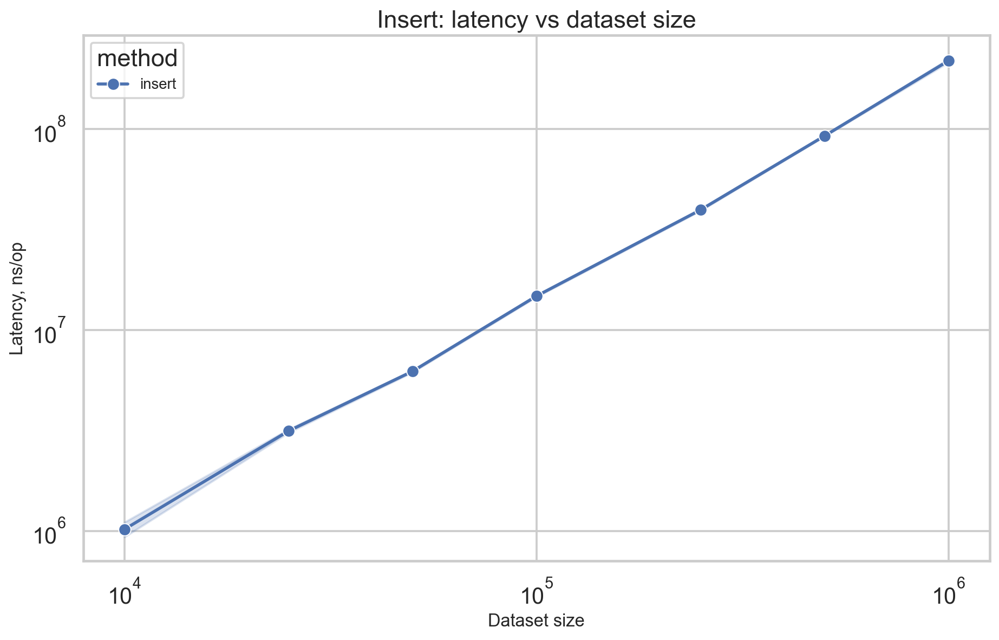
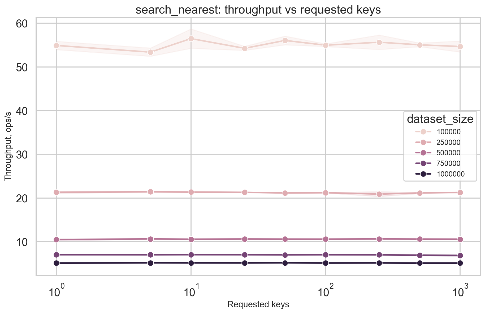
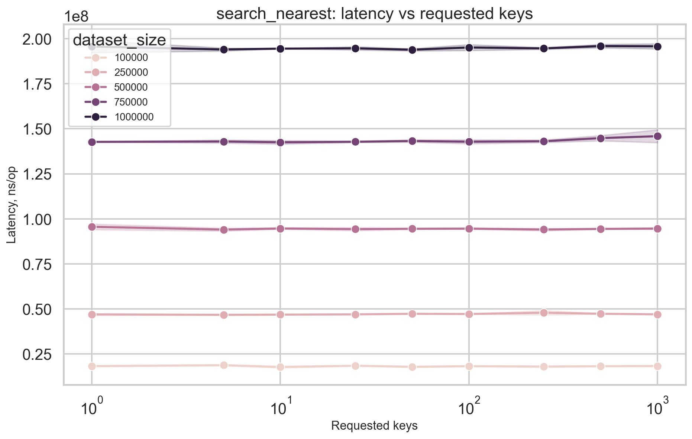
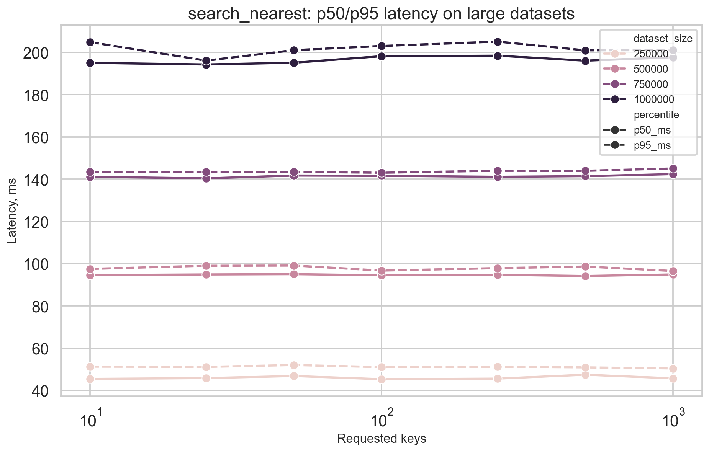
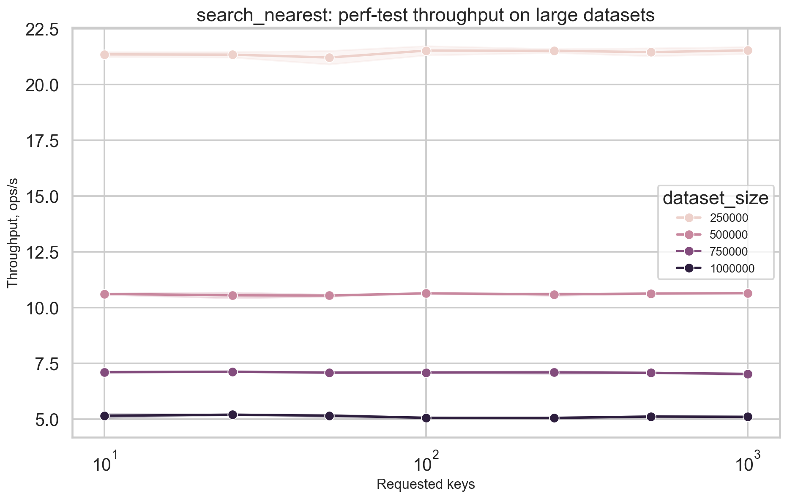
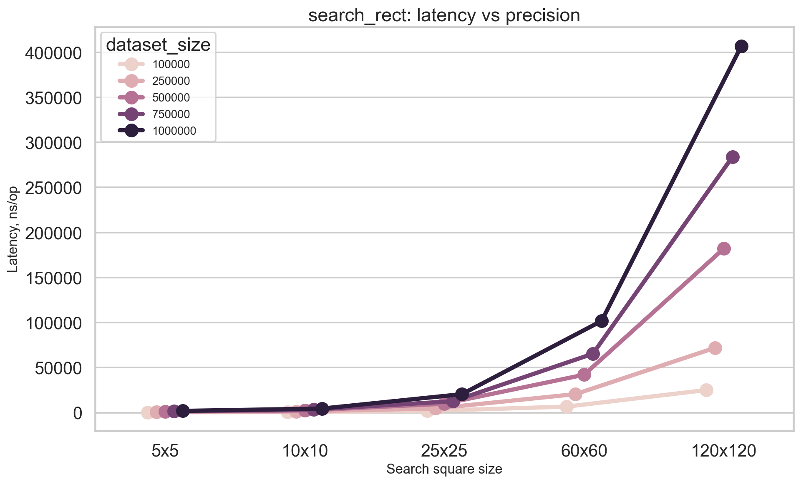

# Лабораторная работа: пространственный поиск геообъектов

Ненов Владислав Александрович, P34082

Язык выполнения лабораторной работы: Go

Структура данных: `quadtree` для пространственного поиска

## Задание
Система должна уметь:
- помещать географически расположенные объекты;
- искать объекты по близким координатам (а не по точному ключу);
- показать в бенчмарках изменение времени работы в зависимости от размера данных, параметров запроса и точности.

В работе для этого реализована структура `quadtree` с операциями:
- `Insert(x, y, payload)`;
- `SearchInRect(minX, minY, maxX, maxY)`;
- `SearchNearestN(x, y, n)`.

---

## Тестирование
Бенчмарки находятся в `pkg/quadtree/benchmark_test.go` и `pkg/quadtree/perf_test.go`.

Покрыты три сценария:
1. **Insert**: как меняется стоимость вставки при росте БД.
2. **SearchNearestN**: влияние числа запрошенных ближайших точек (`keys`) и размера БД.
3. **SearchInRect**: влияние точности (размера окна поиска) и размера БД.

Результаты сохранены в:
- `docs/perf/out/insert.csv`
- `docs/perf/out/search.csv`

Графики: `docs/perf/graphs`.

---

## Результаты и анализ

### 1) Вставка: рост задержки с размером данных

График показывает среднее время одной вставки (`ns/op`) при росте размера дерева. При увеличении БД с `10 000` до `1 000 000` latency растёт примерно с `1.0 млн` до `219 млн ns/op`. Зависимость близка к линейной по размеру набора в рамках этого эксперимента, что соответствует суммарной стоимости массового построения quadtree: каждая вставка в среднем ожидаемо близка к `O(log N)`, но при последовательной вставке всего набора общая стоимость становится существенно выше и на графике выглядит как устойчивый рост с увеличением `N`.

### 2) Поиск ближайших точек

График показывает пропускную способность `SearchNearestN` (`query_ops/s`) при увеличении числа запрашиваемых ближайших точек. Зависимость почти горизонтальная: throughput держится около `19.5-20.1 ops/s` даже при росте кол-ва точек от `1` до `1000`. Для quadtree это ожидаемо: основная стоимость связана с пространственным обходом дерева, а не с длиной выходного списка, поэтому в среднем операция остаётся близкой к `O(log N + k)`, и в данном диапазоне вклад `k` ещё невелик.

### 3) Поиск ближайших: latency vs число ключей

График показывает время одного запроса `SearchNearestN` в зависимости от числа возвращаемых соседей. Latency меняется слабо: примерно от `99 млн` до `100 млн ns/op`, то есть рост почти незаметен. Это хорошо согласуется с поведением quadtree: в среднем поиск ближайших соседей имеет сложность порядка `O(log N + k)`, но при таких данных основное время уходит на поиск подходящих областей дерева, а увеличение `k` слабо влияет на итоговую стоимость.

### 4) Поиск ближайших: перцентили задержек

График показывает `p50` и `p95` задержки поиска ближайших точек на больших наборах данных. Оба перцентиля почти не меняются с ростом `keys`: `p50` остаётся около `119-120 ms`, а `p95` около `122-125 ms`. Это говорит о стабильной работе quadtree без выраженных хвостов задержек: даже в тяжёлых сценариях стоимость запроса остаётся близкой к ожидаемой `O(log N + k)` и не даёт резких всплесков времени ответа.

### 5) Поиск ближайших: производительность на больших БД

График показывает пропускную способность `SearchNearestN` на больших датасетах в perf-сценарии. Зависимость почти постоянная: throughput находится примерно на уровне `11 ops/s` для всех значений `keys` от `10` до `1000`. Для quadtree это подтверждает, что при больших объёмах данных доминирует стоимость обхода дерева, а не размер ответа, поэтому средняя цена операции остаётся близкой к `O(log N + k)` с небольшим влиянием `k`.

### 6) Поиск в прямоугольнике: latency vs precision

График показывает время `SearchInRect` при увеличении размера квадрата поиска: от `5x5` до `120x120`. Зависимость резко возрастающая: средняя latency растёт примерно с `1.1 тыс.` до `194 тыс. ns/op`. Для quadtree это естественно, потому что поиск в прямоугольнике имеет стоимость порядка `O(log N + m)`, где `m` — число найденных точек и пересечённых областей; при увеличении окна поиска растёт и число затронутых узлов дерева, и размер результата, поэтому время увеличивается быстро.

---

## Итог
- реализована структура для размещения географических объектов в двухмерном пространстве;
- реализован поиск по близким координатам (в диапазоне и по ближайшим точкам);
- проведены бенчмарки и показано, как время и пропускная способность зависят от:
  - размера БД,
  - количества запрашиваемых ближайших точек,
  - размера указанной в запросе площади.

Практический вывод:

- `SearchInRect` хорошо демонстрирует ожидаемое поведение пространственного индекса: при увеличении размера окна поиска стоимость запроса заметно растёт, поскольку quadtree вынужден обходить больше узлов и возвращать больше точек. Здесь явно проявляется trade-off между точностью локального поиска и производительностью: чем больше область, тем полнее результат, но тем выше latency и ниже throughput.
- `SearchNearestN` в текущей реализации, напротив, гораздо сильнее зависит от общего размера набора данных, чем от числа запрашиваемых соседей. Это видно из графиков и заметной деградации производительности при росте размера датасета. Практически это означает, что стоимость запроса определяется дорогим обходом структуры и поиском кандидатов в большом дереве.
